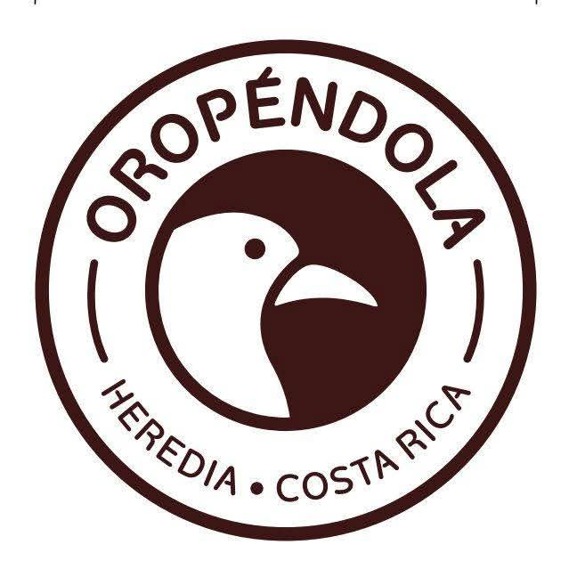

# 🚀 Guía de Configuración

## ✅ Estructura Creada

Tu repositorio de Oropéndola ya está organizado con la siguiente estructura:

```
Oropendola/
├── 📄 index.html               ← Página principal
├── 📄 README.md                ← Documentación
├── 📄 .gitignore               ← Configuración Git
├── 📁 assets/
│   ├── 📁 images/              ← Carpeta para imágenes
│   ├── 📁 css/                 ← Carpeta para estilos (opcional)
│   └── 📁 js/                  ← Carpeta para scripts (opcional)
└── 📷 [Imágenes locales existentes]
```

## 📋 Pasos Siguientes

### 1️⃣ **Pasar Imágenes a la Carpeta assets/images/**

Las imágenes están actualmente en la raíz del proyecto. Muévelas a `assets/images/`:

```
✓ logo.png.jpeg
✓ juntos2.jpeg
✓ Casapachuca1.jpeg
✓ Casazocalo1.jpeg
✓ Casaexpresidente1.jpeg
✓ Casaobrera1.jpeg
✓ Casavictoriana1.jpeg
✓ Casacolonial1.jpeg
✓ Casatipica1.jpeg
```

### 2️⃣ **Actualizar Rutas en index.html**

Si usaste el HTML proporcionado, las rutas ya apuntan a `assets/images/`.
Si estás usando el HTML existente, actualiza las rutas de imágenes:

```html
<!-- CAMBIAR DE: -->


<!-- A: -->

```

### 3️⃣ **Verificar en Navegador**

1. Abre el archivo `index.html` en tu navegador
2. Verifica que todas las imágenes se cargan correctamente
3. Prueba el carrusel automático (cambia cada 5 segundos)
4. Verifica los enlaces a redes sociales

### 4️⃣ **Inicializar Git (Opcional)**

```bash
cd "c:\Users\laptop\OneDrive\Desktop\Proyectos\Oropendola"
git init
git add .
git commit -m "Inicial: Estructura del proyecto Oropéndola"
```

### 5️⃣ **Personalizar (Opcional)**

**Extraer CSS a archivo separado:**
- Crea `assets/css/styles.css`
- Copia el contenido de `<style>` del HTML
- Vincula: `<link rel="stylesheet" href="assets/css/styles.css">`

**Extraer JavaScript a archivo separado:**
- Crea `assets/js/carousel.js`
- Copia el contenido del `<script>`
- Vincula: `<script src="assets/js/carousel.js"></script>`

## 🎯 Checklist de Validación

- [ ] Las carpetas están organizadas en `assets/`
- [ ] Todas las imágenes están en `assets/images/`
- [ ] El archivo `index.html` carga correctamente
- [ ] El carrusel funciona automáticamente
- [ ] Los enlaces a WhatsApp, Instagram, Facebook funcionan
- [ ] El email de contacto funciona
- [ ] Responsive se ve bien en móvil

## 📱 Pruebas Recomendadas

```
✓ Desktop (Chrome, Firefox, Safari)
✓ Tablet (iPad, Android)
✓ Móvil (iPhone, Android)
✓ Validar HTML: https://validator.w3.org/
✓ Validar CSS: https://jigsaw.w3.org/css-validator/
```

## 🔧 Útiles

- **Live Server (VS Code)**: Click derecho en index.html → "Open with Live Server"
- **Python**: `python -m http.server 8000` en la carpeta raíz
- **Node.js**: Instala `http-server` con `npm install -g http-server`

---

¡Tu sitio de Oropéndola está listo para desarrollo! 🌳✨
